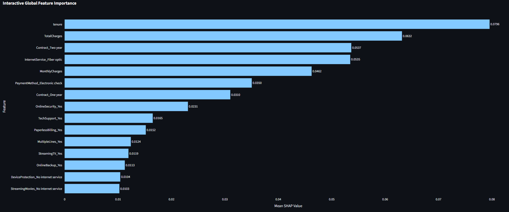
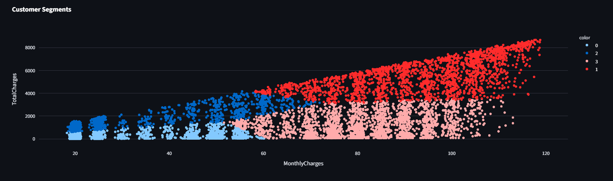

# NexusIQ

AI-powered customer intelligence platform for churn prediction, customer segmentation, customer review analytics, support intelligence, and explainable AI.

---

## Overview

NexusIQ is an enterprise-style AI analytics platform designed to help organizations understand customer behavior, predict churn risk, analyze customer sentiment, classify support tickets, and generate actionable business insights.

The platform combines:

- Machine Learning
- NLP (Transformer-based sentiment analysis)
- Explainable AI
- Interactive dashboards
- API-based model serving
- Dockerized deployment

into a unified customer intelligence system.

---

## Features

### Customer Retention Analytics
- Predict customer churn probability
- Interactive churn prediction engine
- Real-time business recommendations

### Customer Segmentation
- AI-driven customer grouping
- Behavioral segmentation analysis
- Customer distribution visualization

### Customer Review Analytics
- Transformer-based sentiment analysis
- Complaint type detection
- Business action recommendations

### Support Intelligence
- AI-powered support ticket classification
- Priority detection
- Operational recommendations

### Explainable AI
- SHAP-based feature importance
- Interactive model interpretability
- Churn driver visualization

### API Integration
- FastAPI backend for model serving
- REST API-based prediction workflow

### Dockerized Deployment
- Containerized Streamlit dashboard
- Containerized FastAPI backend
- Docker Compose orchestration

---

# Dashboard Preview



---



---

## Tech Stack

| Category | Technologies |
|---|---|
| Programming | Python |
| Dashboard | Streamlit |
| Backend API | FastAPI |
| Machine Learning | Scikit-learn, XGBoost |
| NLP | Transformers, Hugging Face |
| Explainability | SHAP |
| Visualization | Plotly |
| Data Processing | Pandas, NumPy |
| Deployment | Docker, Docker Compose |

---

## Project Structure

```text
NexusIQ/

├── app/
│   ├── dashboard.py
│   ├── churn.py
│   ├── segmentation.py
│   ├── sentiment.py
│   ├── explainability.py
│   └── ticket_classifier.py
│
├── api/
│   └── main.py
│
├── data/
│   ├── raw/
│   └── processed/
│
├── models/
│
├── notebooks/
│
├── assets/
│
├── Dockerfile
├── docker-compose.yml
├── requirements.txt
├── README.md
└── .gitignore
```

---

## Installation

### Clone Repository

```bash
git clone https://github.com/manimozhi-ds/NexusIQ.git

cd NexusIQ
```

---

## Create Virtual Environment

### Windows (Git Bash)

```bash
python -m venv venv

source venv/Scripts/activate
```

---

## Install Dependencies

```bash
pip install -r requirements.txt
```

---

# Run Application

## Run Streamlit Dashboard

```bash
streamlit run app/dashboard.py
```

---

## Run FastAPI Backend

```bash
python -m uvicorn api.main:app --reload
```

API runs on:

```text
http://127.0.0.1:8000
```

---

# Docker Deployment

## Build and Run Containers

```bash
docker compose up --build
```

---

## Access Dashboard

```text
http://localhost:8501
```
## Live Demo

Frontend (Hugging Face):
https://huggingface.co/spaces/manimozhi-ds/NexusIQ

Backend API:
https://nexusiq-api.onrender.com

---

## Sample Modules

- Overview
- Churn Analytics
- Customer Segments
- Review Intelligence
- Model Insights
- Support Intelligence

---

## Datasets Used

### Customer Churn
- IBM Telco Customer Churn Dataset

### Sentiment Analysis
- Amazon Customer Reviews Dataset

Datasets are not included in this repository due to size limitations.

---

## Future Improvements

- PostgreSQL database integration
- Customer risk scoring engine
- Recommendation engine
- Authentication system
- Cloud deployment
- Real-time streaming analytics

---

## Resume Impact

This project demonstrates:

- End-to-end AI system design
- Enterprise analytics workflow
- NLP and transformer integration
- Explainable AI implementation
- API engineering
- Dashboard development
- Dockerized deployment

---

## Author
 
Developed by Manimozhi Sekar
